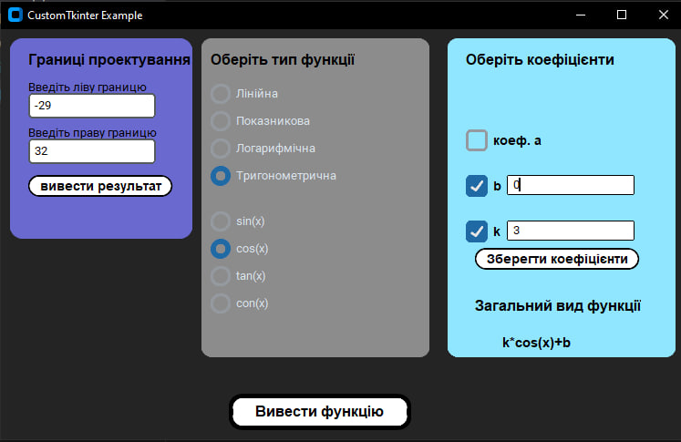
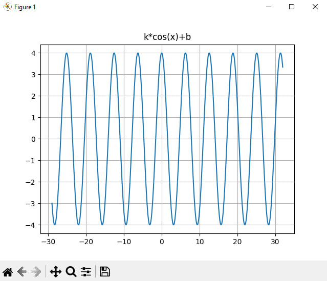

# Function Drawer

This is my new project where I explored Python  
and its libraries such as **NumPy, Matplotlib,**  
**Tkinter, and CustomTkinter.**

In this program, you can create simple functions  
by entering coefficients and observing them  
within a specific interval, which you also set.

## How to Use the Program

1. Open the program
2. In the left window, specify the interval  
   for plotting the function
3. Choose the type of function
4. Enter the required coefficients
5. Click the buttons in the two small windows
6. Click the bottom button
7. Done! Here is your function

## Future Updates

- Add the ability to create more than one function
- Improve the main window interface
- Improve the function window interface

## Screnshot of this program

